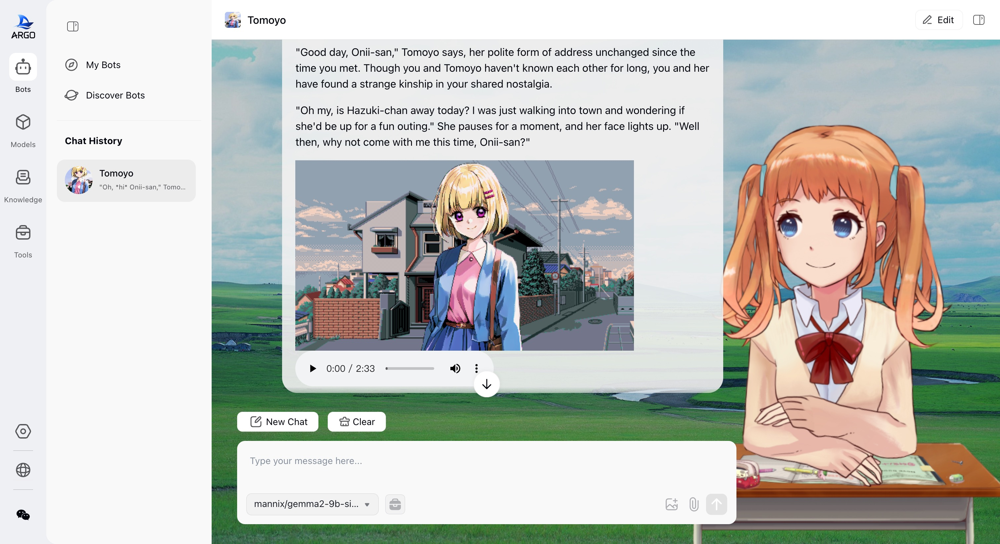
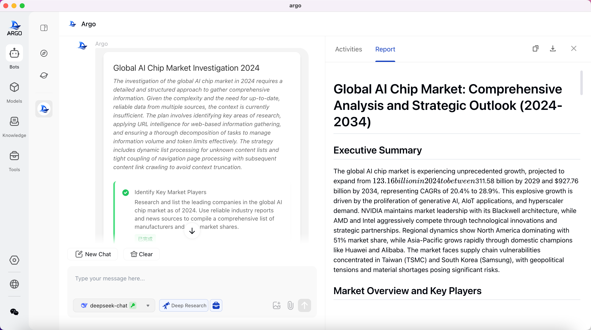
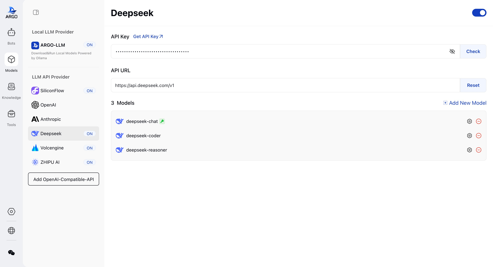
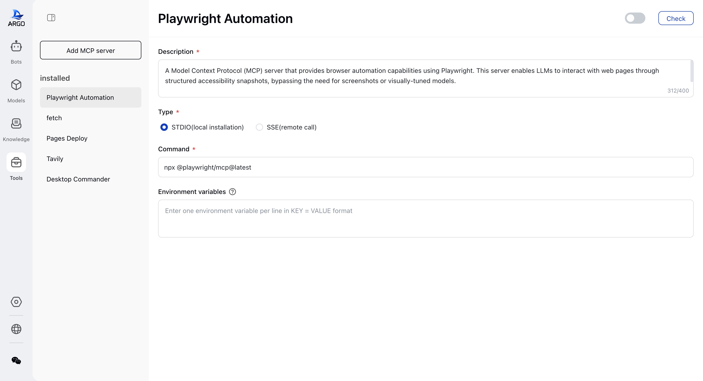

<h1 align="center">
  <a href="https://github.com/xark-argo/argo/releases">
    <br>
  </a>
</h1>
  <p align="center"><a href="./README_CN.md">中文</a> | English | <a href="https://xark-argo.com">Official Website</a> | <a href="https://docs.xark-argo.com/">Documentation</a> | <a href="">Contribute</a> | <a href="https://github.com/xark-argo/argo/issues">Feedback</a><br>
</p>
<!-- 题头徽章组合 -->
<p align="center">
  <a href="https://deepwiki.com/xark-argo/argo"></a>
  <a href="https://twitter.com/xark_argo"></a>
  <a href="https://discord.com/invite/xark-argo"></a>
  <a href="https://github.com/user-attachments/assets/eaed622a-e4bf-4649-bbf0-fab71a635a4c"></a>
</p>

<p align="center">
<a href="https://github.com/xark-argo/argo/stargazers"></a>
  <a href="https://github.com/xark-argo/argo/network/members"></a>
  <a href="https://github.com/xark-argo/argo/blob/main/LICENSE"></a>
  <a href="https://github.com/xark-argo/argo/releases"></a>
</p>


# ⛵️ ARGO - Your Local Super AI Agent

ARGO is an open-source AI Agent client that makes it easy to **build & use** AI-powered assistants capable of autonomous thinking, task planning, and handling complex tasks. It supports one-click download of open-source models and integrates closed-source models, providing convenient access to local RAG knowledge bases and MCP tools. In addition, ARGO can be **fully deployed privately, secure and controllable**, with 100% data stored locally, supporting offline operation, and is compatible with Windows, Mac, and Linux systems.

The vision of ARGO is to allow every user to have their own **"exclusive super AI Agent"**, enabling more people to benefit from the convenience AI Agents bring.

## Why Choose ARGO?
* 🔒 **Local First, Privacy Above All** — Supports full offline operation, 100% local data storage, with native clients for Windows, macOS, and Linux, plug-and-play with no configuration required. Fully compatible with public cloud, private cloud, local servers, and all-in-one machines.
* 🚀 **Task Execution Engine That Delivers Results** — The Multi-Agent task engine autonomously plans steps, calls tools, generates reports, and executes multi-stage tasks in full.
* ⚙️ **Agent Factory** — Need a travel planning assistant, industry analyst, or legal advisor? Simply describe it, and ARGO can help you customize a dedicated agent for your scenario.
* 📦 **Integrates Ollama and Leading Providers** — Instantly access OpenAI, Claude, DeepSeek, or run local Ollama models, with open access and no platform lock-in. Seamlessly switch between local models and API models during conversations.
* 🧩 **Agentic RAG Knowledge Engine** — Supports various knowledge entry methods including files, folders, websites, etc., and dynamically synchronizes folders. The Agentic mode intelligently decomposes complex issues and provides more complete and reliable answers.
* 🛠️ **Built-in Powerful Toolset, MCP Protocol Support** — Includes a powerful toolset such as web crawlers, browser control, local file management, and more, with support for custom extensions and integration of your own tools.
* 🧠 **Self-Evolving Agent** — Learns work habits and preferences during use. ARGO can autonomously optimize the agent, evolving into a super agent that truly understands you. (In testing)

👏 Join us on [Discord](https://discord.gg/TuMNxXxyEy) | [Twitter](https://x.com/ThinkInAgent) | [WeChat Group](https://github.com/user-attachments/assets/d5206618-c32d-4179-9ab7-f74d8cc8706e)
❤️ Love ARGO? Give us a star 🌟 to receive all release notifications from GitHub!
⚠️️ The project is still in the early stages, actively being developed. We appreciate your contributions, feedback, and patience.
🔗 Official website: https://xark-argo.com/
📚 Quick Start Guide: https://docs.xark-argo.com/getting-started


# 📑 Table of Contents
- [ 🌠 Interface](#interface)
- [🌟 Features](#features)
- [ 📝 Development Plan](#development-plan)
- [📦 Quick Start](#quick-start)
- [🤝Contributing](#contributing)
- [📃 License](#license)
- [⭐️ Star History](#star-history)


# 🌠 Interface






# 🌟 Features
- 📦 **Flexible Integration of Open-Source and Closed-Source Models**:
  - **One-click Ollama Integration**: Integrates Ollama with no command-line operations needed to control and manage model downloads, deployment, and running.
  - **Compatible with HuggingFace**: Supports one-click downloading of models in HuggingFace GGUF format.
  - **Chat Template Adaptive to Models**: Automatically adapts the chat template when downloading open-source models.
  - **Compatible with Leading Model APIs**: Supports integration with OpenAI, Claude, DeepSeek, and any service provider compatible with the OpenAI format, breaking platform lock-in.
  - **Flexible Model Switching**: Seamlessly switch between local models and API models during conversations to balance performance and cost.

- 🏠 **DeepResearch & Multi-Agent Collaboration**:
  - **Multi-Agent Task Engine**: Multiple agents collaborate to handle complex tasks.
  - **Complete Agentic Workflow**:
    - **Intent Recognition**: Precisely understands user needs.
    - **Task Planning**: Autonomously breaks down complex tasks.
    - **Task Execution**: Efficiently carries out multi-step processes.
    - **Tool Calling**: Flexible use of multiple external tools.
    - **Self-reflection**: Reflects on execution and self-corrects.
    - **Self-summary**: Provides structured result outputs.
  - **Human-in-the-loop**: After task planning, natural language modifications can be made to the research plan.

- 🧩 **Local RAG Knowledge Base**:
  - **Multiple Knowledge Entry Methods**: Supports adding knowledge through files, folders, websites, etc.
  - **Dynamic Knowledge Base Sync**: When binding local folders, content changes automatically synchronize to the knowledge base, ensuring information is always up to date.
  - **Multi-format Document Parsing**: Supports parsing of PDFs, Word, Excel, PPT, web pages, Markdown, plain text, etc.
  - **Answer Traceability**: When using the knowledge base to answer questions, it is traceable to specific reference fragments.
  - **Privacy Protection**: Local storage of vectorized data reduces security risks.
  - **Agentic RAG**: Smart decomposition of complex issues, autonomous assessment of information sufficiency, and generation of more complete and reliable answers.

- 🛠️ **MCP Protocol & Tool Support**:
  - **Out-of-the-box Tool Library**: Built-in tools like network search, web crawlers, browser control, local file management, and more.
  - **Configurable Expansion**: Supports local (STDIO) and remote (SSE) integration of MCP tools for easy expansion and integration.

- 🤖 **Agent Factory**:
  - **Visual Scenario Agent Creation**: Customize scenario assistants with role setting, model binding, variable configuration, and tool integration (e.g., industry research reports, travel planning).
  - **Continuous Iteration**: The agent iterates through natural language and learns to better understand the user over time.
  - **One-click Sharing & Importing**: Share agent configurations with the community, covering scenarios like writing, programming, translation, research, and education.

- 🤖 **Chat Conversations**:
  - **Formula Rendering**: Supports KaTeX formula rendering for academic use.
  - **Mermaid Rendering**: Supports Mermaid chart visualization, allowing creation of flowcharts, sequence diagrams, Gantt charts, etc.
  - **Artifacts Rendering**: Supports displaying results in html, svg, xml code.
  - **Free Branching**: Conversations can freely branch, quickly cloning the conversation process.

- 🔒 **Privacy Protection & Cross-Platform Experience**:
  - **Local Data Storage**: All data is stored locally, supporting offline operation and ensuring privacy and security.
  - **Cross-platform Support**: Supports native clients for Windows, macOS, and Linux, along with Web versions, with zero dependencies, plug-and-play, and full compatibility with public/private cloud/local servers/all-in-one machines.
  - **No Registration Required**: No account registration or cloud dependency, making it ideal for privacy-sensitive individuals and businesses.

# 🔍 Use Cases
- **Personal Assistant**: Manage schedules, provide shopping suggestions, and help with daily tasks to improve user efficiency.
- **Study Assistant**: Help students understand complex concepts, offer academic resources, create custom study plans, and give revision suggestions.
- **Content Creation**: Automatically generate copy, optimize writing style, and assist creators in improving content creation efficiency.
- **Development Assistance**: Provide code generation, debugging, and technical support to help developers solve programming problems more efficiently.
- **Industry-specific Assistants**: Custom AI agents like legal advisors, industry analysts to meet professional needs.
- **Data Analysis**: Quickly analyze data, generate charts and reports to support data-driven decision-making.
- **Knowledge Management**: Automatically parse documents and build knowledge bases to help businesses organize and query knowledge.
- **Privacy Protection**: Provide offline operation and local storage to ensure user data privacy and security.

# 📝 Development Plan
- Save and share the agent’s operation process.
- Global personalization memory to make ARGO more understanding of users and capable of delivering results.
- Support using local browsers to simulate user web browsing to gather information.
- Support scheduled tasks.
- More vertical agent scenarios.

Feel free to join our community and share your thoughts and feedback! [Discord](https://discord.gg/TuMNxXxyEy) | [WeChat Group](https://github.com/user-attachments/assets/d5206618-c32d-4179-9ab7-f74d8cc8706e) | [GitHub Discussions](https://github.com/xark-argo/argo/discussions/categories/ideas)


# 📦 Quick Start
### Hardware Requirements 🐳

> Before installing Argo, ensure that your machine meets the following minimum system requirements:
>
>- CPU >= 4 cores
>- RAM >= 8 GB
>
> Additional software requirements when using [Docker](https://www.docker.com/):
>- Docker >= 24.0.0
>- Docker Compose >= v2.26.1
>
> Tip: To enable CUDA in Docker, you need to install the [Nvidia CUDA container toolkit](https://docs.nvidia.com/dgx/nvidia-container-runtime-upgrade/)

### Quick Desktop App Installation

Download, double-click, and complete installation.

- Macos silicon: [argo-0.3.0-osx-installer.dmg](https://github.com/xark-argo/argo/releases/download/v0.3.0/argo-0.3.0-osx-installer.dmg)
- Macos intel: [argo-0.3.0-mac-intel-installer.dmg](https://github.com/xark-argo/argo/releases/download/v0.3.0/argo-0.3.0-mac-intel-installer.dmg)
- Windows 64bit (Win 10 and above): [argo-0.3.0-windows-x64-installer.exe](https://github.com/xark-argo/argo/releases/download/v0.3.0/argo-0.3.0-windows-installer.exe)

### Quick Start with [Docker](https://www.docker.com/) 🐳

#### Install Argo without Ollama
- **Use External Ollama**:
 
  The feature to download models from [huggingface](https://huggingface.co/) will be disabled!

  ```bash
  docker run -d -p 38888:80 -e OLLAMA_BASE_URL=https://example.com -e USE_HF_MIRROR=true -v ./argo:/root/.argo --name argo --restart always xark/argo:main
  ```
- **If Ollama is in a different container on your machine**:

  If you need to use the Huggingface model download feature, set `USE_ARGO_OLLAMA` to `true` and mount the Argo folder to the Ollama container using `-v ./argo:/root/.argo`.

  ```bash
    docker run -d -p 38888:80 -e USE_ARGO_OLLAMA=true -e OLLAMA_BASE_URL=https://example.com -e USE_HF_MIRROR=true -v ./argo:/root/.argo --name argo --restart xark/argo:main
  ```

#### Install Argo with Ollama Support
This installation method uses a single container image that bundles Argo with Ollama for simplified setup via one command. Choose the appropriate command based on your hardware setup:
- **Use GPU**:

  To utilize GPU resources, run the following command:

  ```bash
  docker run -d -p 38888:80 --gpus=all -e USE_HF_MIRROR=true -v ./ollama:/root/.ollama -v ./argo:/root/.argo --name argo --restart always xarkai/argo:ollama
  ```

- **Use CPU Only**:

  If you do not want to use GPU, run the following command:

  ```bash
  docker run -d -p 38888:80 -e USE_HF_MIRROR=true -v ./ollama:/root/.ollama -v ./argo:/root/.argo --name argo --restart always xark/argo:ollama
  ```

Once installed, you can access Argo at http://localhost:38888.

# 🖥️ Develop

Refer to the [development documentation](docs/DEV_GUIDE.md)

# 🤝 Contributing
ARGO is currently in its early stages of development, and we are actively working to improve functionality and fix issues. Before it reaches a stable version, you may encounter some usability issues or instability. We sincerely request your understanding and support!

ARGO is an active open-source community project, and we welcome contributions in various forms:
1. **Contribute Code**: [Develop new features or optimize existing code](https://github.com/xark-argo/argo/pulls)
2. **Submit Bugs**: [Submit bugs you find](https://github.com/xark-argo/argo/issues)
3. **Maintain Issues**: [Help manage GitHub issues](https://github.com/xark-argo/argo/issues)
4. **Product Design**: [Participate in design discussions](https://github.com/xark-argo/argo/discussions/categories/ideas)
5. **Write Documentation**: [Improve user manuals and guides](https://docs.xark-argo.com/)
6. **Community Engagement**: Join discussions and assist users on [Discord](https://discord.gg/TuMNxXxyEy) | [WeChat Group](https://github.com/user-attachments/assets/d5206618-c32d-4179-9ab7-f74d8cc8706e)
7. **Promote ARGO**: Spread the word about ARGO, give us a star ❤️

Please refer to our [Contribution Guide](./CONTRIBUTING.md) for code contributions.
Thank you for your support and contributions!

## Contributors

<a href="https://github.com/xark-argo/argo/graphs/contributors">
  
</a>

# 📃 License

[LICENSE](LICENSE)

# ⭐️ Star History

[](https://star-history.com/#xark-argo/argo&Timeline)
