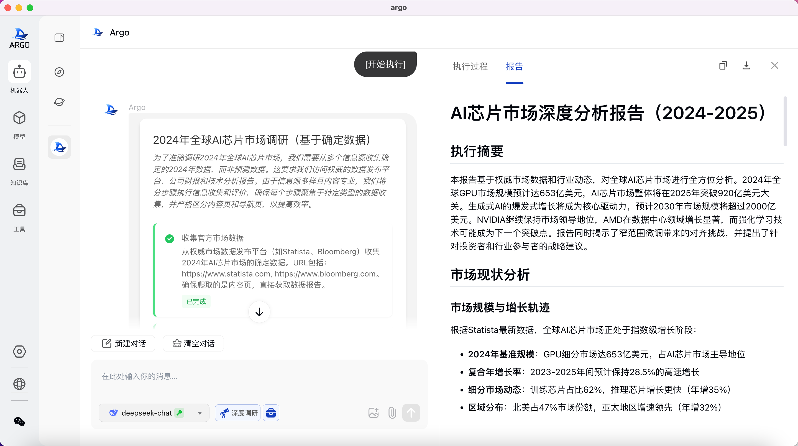

<h1 align="center">
  <a href="https://github.com/xark-argo/argo/releases">
    <br>
  </a>
</h1>
  <p align="center"><a href="./README.md">English</a> | 中文 | <a href="https://xark-argo.com">官方网站</a> | <a href="https://docs.xark-argo.com/zh-CN/">文档</a> | <a href="">贡献</a> | <a href="https://github.com/xark-argo/argo/issues">反馈</a><br>
</p>
<!-- 题头徽章组合 -->
<p align="center">
  <a href="https://deepwiki.com/xark-argo/argo"></a>
  <a href="https://twitter.com/xark_argo"></a>
  <a href="https://discord.com/invite/xark-argo"></a>
  <a href="https://github.com/user-attachments/assets/eaed622a-e4bf-4649-bbf0-fab71a635a4c"></a>
</p>

<p align="center">
<a href="https://github.com/xark-argo/argo/stargazers"></a>
  <a href="https://github.com/xark-argo/argo/network/members"></a>
  <a href="https://github.com/xark-argo/argo/blob/main/LICENSE"></a>
  <a href="https://github.com/xark-argo/argo/releases"></a>
</p>


# ⛵️ ARGO-您的本地超级智能体

ARGO是一个开源的AI智能体客户端，可轻松**构建&使用**具备自主思考、任务规划、处理复杂任务的AI智能助手，支持一键下载开源模型、配置接入闭源模型，便捷的使用本地RAG知识库和MCP工具。此外ARGO可以**完全私有部署，安全可控**，数据100%本地存储，支持纯离线运行，兼容 Windows、Mac 和 Linux 系统。

ARGO的愿景是让每一个使用者都拥有自己的**“专属超级智能体”**，让更多人享受到AI Agent带来的便利。

## 为什么选择 ARGO?
* 🔒 本地优先，隐私至上 —— 支持完全离线运行，数据100%本地存储，支持Windows、macOS、Linux本地客户端，开箱即用，无需配置环境，全面兼容公有云/私有云/本地服务器/一体机。
* 🚀 能交付结果的任务执行引擎 —— Multi-Agent任务引擎可自主规划步骤、调用工具、生成报告，实现多阶段任务的完整执行。
* ⚙️ 智能体工厂 —— 需要旅游规划助手、行业分析师或法律顾问？只需用语言描述，ARGO 就能帮你定制专属场景智能体。
* 📦 集成Ollama 和主流供应商 —— 即时接入 OpenAI、Claude、DeepSeek，或本地运行 Ollama 模型，开放接入，无平台绑定，本地模型与API模型在对话时可无缝切换。
* 🧩 Agentic RAG知识引擎 —— 支持文件、文件夹、网站等多种入库方式，支持文件夹动态同步更新。Agentic模式支持智能拆解复杂问题，提供更完整、更可信的答案。
* 🛠️ 内置强大工具集，支持MCP协议 —— 开箱即用包括网络爬虫、浏览器控制、本地文件管理等强大工具，同时支持自定义扩展，接入你的专属工具。
* 🧠 自主进化的智能体 —— 在使用过程中深度学习工作习惯与偏好，ARGO 能自主优化智能体，成为真正懂你专属个人的超级智能体。（测试中）


👏 欢迎加入 [Discord](https://discord.gg/TuMNxXxyEy) | [Twitter](https://x.com/ThinkInAgent) | [微信群](https://github.com/user-attachments/assets/d5206618-c32d-4179-9ab7-f74d8cc8706e)
❤️ 喜欢 ARGO? 点亮小星星 🌟您将立即收到来自 GitHub 的所有发布通知！
⚠️️ 项目任然在起步阶段，正在积极开发中，非常感谢大家的贡献、反馈与耐心
🔗 官网地址：https://xark-argo.com/
📚 快速教程：https://docs.xark-argo.com/getting-started

#📑 目录
- [ 🌠 界面](#界面)
- [🌟 特性](#特性)
- [ 📝 开发计划](#开发计划)
- [📦 快速启动](#快速启动)
- [🤝贡献](#贡献)
- [📃 许可证](#许可证)
- [⭐️ Star 记录](#Star 记录)

# 🌠 界面





# 🌟 特性
- 📦 **开源和闭源模型灵活接入**：
  - **一键集成 Ollama**：集成Ollama，无需命令行操作即可控制和管理Ollama模型的下载、部署和运行。
  - **兼容HuggingFace**：支持HuggingFace GGUF格式的模型一键下载。
  - **模型chat-template自适应**：开源模型下载安装即自动适配Chat模板，简化使用。
  - **兼容主流模型API**：支持接入OpenAI、Claude、DeepSeek等商业模型及任何兼容OpenAI格式的服务商，打破平台绑定。
  - **模型灵活切换**：本地模型与API模型在对话时可无缝切换，可根据需要自由选择性能与成本平衡。

- 🏠 **DeepResearch & 多智能体协同**：
  - **Multi-Agent任务引擎**：多智能体分工协作，处理复杂任务。
  - **完整的Agentic工作流程**：
    - **意图识别**：精准理解用户需求。
    - **任务规划**：自主拆解复杂任务。
    - **任务执行**：高效执行多步骤流程。
    - **工具调用**：灵活使用多种外部工具。
    - **自我反思**：反思执行情况并自我纠正。
    - **自我总结**：提供结构化结果输出。

  - **人在回路**：任务规划后，支持使用自然语言修改研究计划

- 🧩 **本地RAG知识库**：
  - **多种知识入库方式**：支持通过文件、文件夹、网站等方式添加知识库。
  - **动态知识库同步**：绑定本地文件夹后，内容变更实时自动同步至知识库，确保信息始终最新。
  - **多格式文档解析**：支持PDF、Word、Excel、PPT、网页、Markdown、纯文本等格式。
  - **回答可溯源**：使用知识库回答问题时，可溯源具体参考的知识片段。
  - **隐私安全保障**：本地存储向量化数据，降低数据安全风险。
  - **Agentic RAG**：智能拆解复杂问题，自主评估信息充分性，生成更完整、更可信的答案。

- 🛠️ **MCP协议与工具支持**：
  - **开箱即用工具库**：内置联网搜索、网络爬虫、浏览器控制、本地文件控制等MCP工具集。
  - **配置扩展能力**：支持本地（STDIO）、远程（SSE）方式接入MCP工具，便于扩展与集成。

- 🤖 **智能体工厂**：
  - **可视化制定场景智能体**：角色设定、模型绑定、变量配置、工具集成等定制专属场景助手（如行业研究报告、旅游规划）。
  - **持续迭代**：智能体通过自然语言迭代，随着使用越来越懂你。
  - **一键分享与导入**：支智能体配置分享到社区，覆盖写作、编程、翻译、调研、教育等场景

- 🤖 **聊天对话**：
  - **公式渲染**：支持KaTeX公式渲染，方便学术领域使用。
  - **Mermaid渲染**：支持Mermaid 图表可视化，可绘制流程图、时序图、甘特图等。
  - **Artifacts渲染**：支持html、svg、xml代码结果展示。
  - **自由分支**：对话可自由分支，快速克隆对话过程。

- 🔒 **隐私保障与跨平台体验**：
  - **数据本地存储**：所有数据本地存储，支持纯离线运行，保障隐私安全。
  - **跨平台支持**：支持Windows、macOS、Linux本地客户端与Web版本同步使用，零依赖，开箱即用，无需配置环境，全面兼容公有云/私有云/本地服务器/一体机。
  - **无需注册**：无需注册账号，无云依赖，适用于对隐私敏感的个人与企业用户。

# 🔍 使用场景
- **个人助手**：管理日程、提供购物建议等日常事务，帮助用户提高效率。
- **学习助手**：帮助学生理解复杂概念，提供学术资源、定制学习计划和复习建议。
- **内容创作**：自动生成文案、优化写作风格，辅助创作者提高内容创作效率。
- **开发辅助**：提供代码生成、调试和技术支持，帮助开发者更高效地解决编程问题。
- **行业专属助手**：定制智能体如法律顾问、行业分析师，满足专业领域的需求。
- **数据分析**：快速分析数据、生成图表和报告，帮助决策者做出数据驱动的决策。
- **知识管理**：自动解析文档、构建知识库，帮助企业整理和查询知识。
- **隐私保护**：提供离线运行和本地存储，确保用户数据的隐私和安全。

# 📝 开发计划
- 智能体运行过程可保存回放并分享
- 全局个性化记忆让ARGO更懂用户，更能交付结果
- 支持使用本地浏览器模拟用户网页浏览获取信息
- 支持定时任务
- 更多垂类场景Agent

欢迎加入我们社区分享您的想法和反馈！[Discord](https://discord.gg/TuMNxXxyEy) | [微信群](https://github.com/user-attachments/assets/d5206618-c32d-4179-9ab7-f74d8cc8706e) | [GitHub讨论区](https://github.com/xark-argo/argo/discussions/categories/ideas)

# 📦 快速启动
### 硬件要求 🐳

> 在安装 Argo 之前，请确保您的机器满足以下最低系统要求：
>
>- CPU >= 4 核
>- 内存 >= 8 GB
>
> 使用 [Docker](https://www.docker.com/) 时额外的软件要求：
>- Docker >= 24.0.0
>- Docker Compose >= v2.26.1
>
> 提示: 如果要在 Docker 中启用 CUDA，需要安装
> [Nvidia CUDA container toolkit](https://docs.nvidia.com/dgx/nvidia-container-runtime-upgrade/)

### 桌面App快速安装

下载、双击、完成安装.
 
- Macos silicon：[argo-0.3.0-osx-installer.dmg](https://github.com/xark-argo/argo/releases/download/v0.3.0/argo-0.3.0-osx-installer.dmg)
- Macos intel：[argo-0.3.0-mac-intel-installer.dmg](https://github.com/xark-argo/argo/releases/download/v0.3.0/argo-0.3.0-mac-intel-installer.dmg)
- Windows 64bit（win 10 and above）：[argo-0.3.0-windows-x64-installer.exe](https://github.com/xark-argo/argo/releases/download/v0.3.0/argo-0.3.0-windows-installer.exe)

### 使用 [Docker](https://www.docker.com/) 快速开始 🐳

#### 安装不包含 Ollama 的 Argo
- **使用外部 Ollama**:
 
  从 [huggingface](https://huggingface.co/) 下载模型的功能将被禁用！

  ```bash
  docker run -d -p 38888:80 -e OLLAMA_BASE_URL=https://example.com -e USE_HF_MIRROR=true -v ./argo:/root/.argo --name argo --restart always xark/argo:main
  ```

- **如果 Ollama 在您计算机的另一个容器中**:

  如果需要使用 huggingface 模型下载功能，请修改 `USE_ARGO_OLLAMA` 为 `true`，
  并挂载 Argo 文件夹到 Ollama 容器中 `-v ./argo:/root/.argo`

  ```bash
    docker run -d -p 38888:80 -e USE_ARGO_OLLAMA=true -e OLLAMA_BASE_URL=https://example.com -e USE_HF_MIRROR=true -v ./argo:/root/.argo --name argo --restart xark/argo:main
  ```

#### 安装带有 Ollama 支持的 Argo
此安装方法使用单个容器镜像，该镜像将 Argo 与 Ollama 捆绑在一起，从而允许通过单个命令进行简化的设置。请根据您的硬件设置选择适当的命令：
- **使用 GPU**:

  通过运行以下命令来利用 GPU 资源：

  ```bash
  docker run -d -p 38888:80 --gpus=all -e USE_HF_MIRROR=true -v ./ollama:/root/.ollama -v ./argo:/root/.argo --name argo --restart always xarkai/argo:ollama
  ```

- **只使用 CPU**:

  如果你不希望使用 GPU，运行以下命令：

  ```bash
  docker run -d -p 38888:80 -e USE_HF_MIRROR=true -v ./ollama:/root/.ollama -v ./argo:/root/.argo --name argo --restart always xark/argo:ollama
  ```

安装完成后，您可以通过 http://localhost:38888 访问 Argo。

# 🖥️ 开发

请参考 [开发文档](docs/DEV_GUIDE_CN.md)

# 🤝贡献
ARGO目前处于初始开发阶段，我们正在积极完善功能和修复问题。在达到正式稳定版本之前，您可能会遇到一些使用上的问题或不稳定情况。我们诚恳地请求您的理解和支持！

ARGO是一个活跃的开源社区项目，我们欢迎各种形式的贡献
1. **贡献代码**：[开发新功能或优化现有代码](https://github.com/xark-argo/argo/pulls)
2. **提交错误**：[提交您发现的bug错误](https://github.com/xark-argo/argo/issues)
3. **维护问题**：[帮助管理 GitHub 问题](https://github.com/xark-argo/argo/issues)
4. **产品设计**：[参与设计讨论](https://github.com/xark-argo/argo/discussions/categories/ideas)
5. **撰写文档**：[改进用户手册和指南](https://docs.xark-argo.com/)
6. **社区参与**：加入讨论并帮助用户，[Discord](https://discord.gg/TuMNxXxyEy) | [微信群](https://github.com/user-attachments/assets/d5206618-c32d-4179-9ab7-f74d8cc8706e)
7. **推广使用**：宣传 ARGO，给我们star 💖

代码贡献请参阅我们的[贡献指南](./CONTRIBUTING_CN.md)。
感谢您的支持和贡献！

##贡献者

<a href="https://github.com/xark-argo/argo/graphs/contributors">
  
</a>

# 📃 许可证

[LICENSE](LICENSE)

# ⭐️ Star 记录

[](https://star-history.com/#xark-argo/argo&Timeline)
