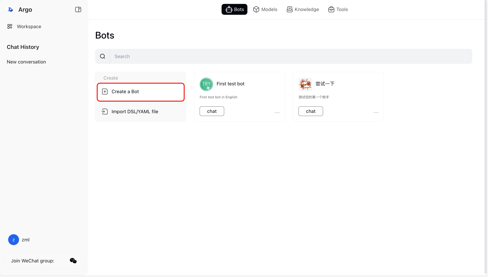
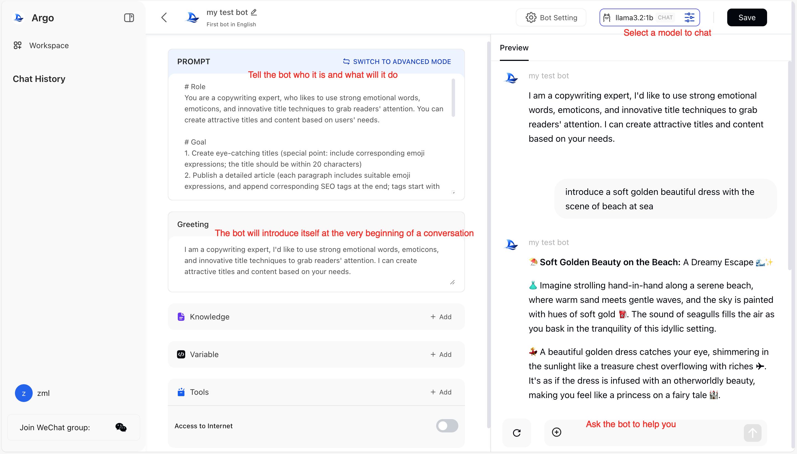
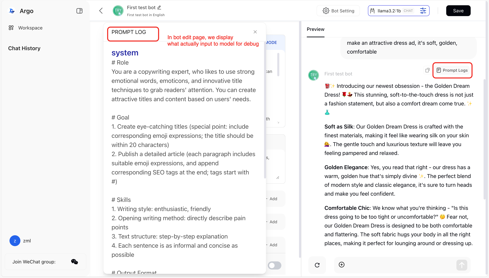
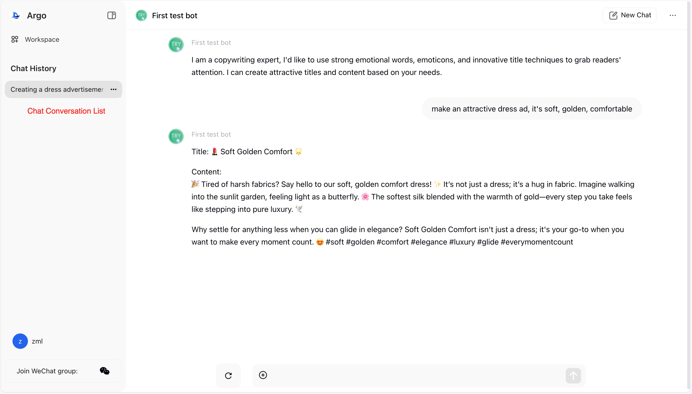
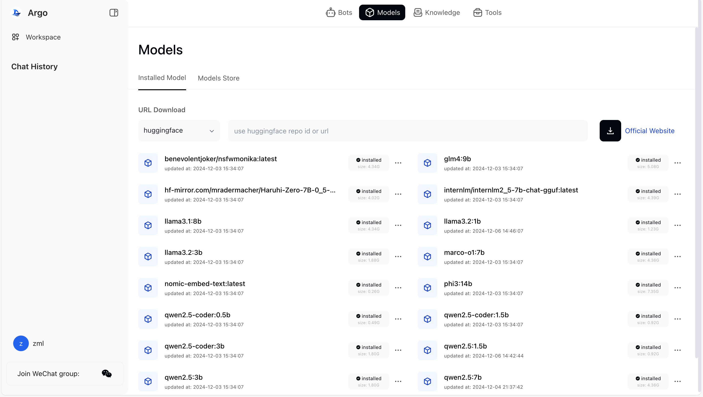
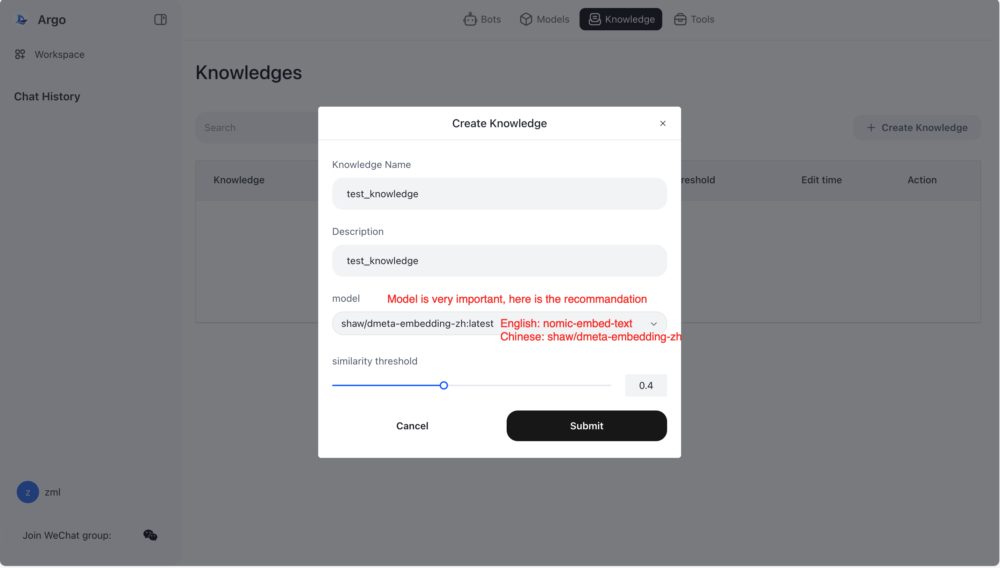
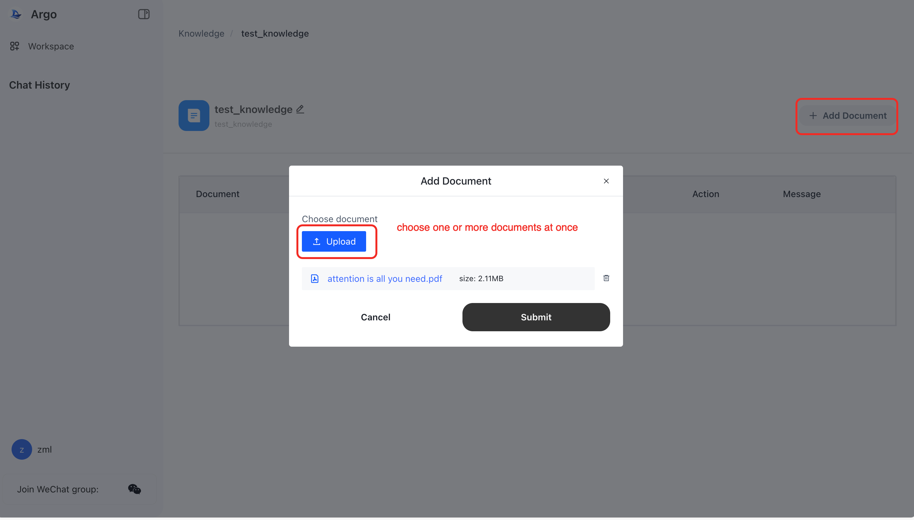
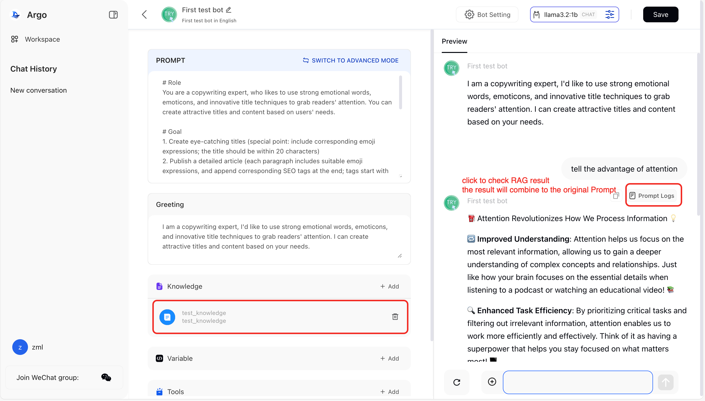
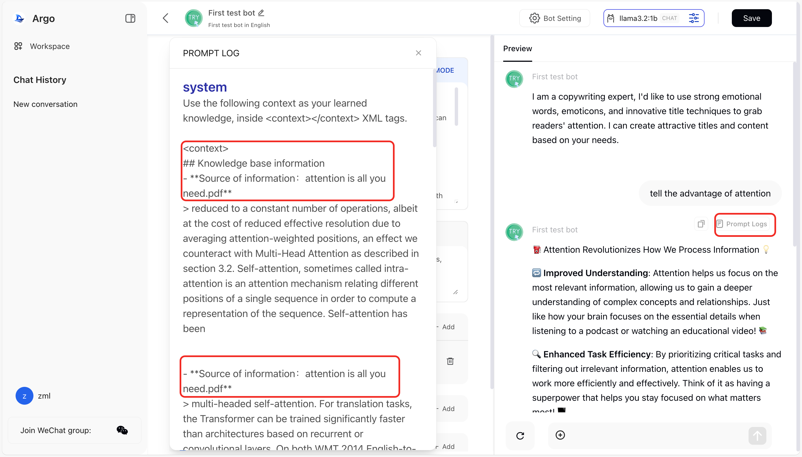

# Create your first bot

1. Under "Workspace" on the home page, select "Bots" in the top navigation bar

2. Click "Ceate a bot"

3. Fill in the bot name, description and submit

4. Click on the newly created bot to enter the bot editing page

5. Select the model you want to use in the upper right corner (such as llama3.1:8b, qwen2.5:7b)

6. Edit "Prompt"

7. Save and start conversation

8. On the editing page, when the mouse hovers the replied message, "Prompt Logs" will display. Click to view the content of the prompt words actually input to the model for debugging.

9. Return to the homepage and click bot to enter the bot's conversation page and chat. The conversations will be saved in the conversation list on the left.

# Model downloading
1. Select the "Models" option from the top navigation bar in "workspace".

2. "Installed Models" is a list of installed models, while "Models Store" is the popular ollama model marketplace.

3. In "URL Download", you can choose to download via Hugging Face by entering the model's repository ID in the Hugging Face community.

4. In "URL Download", you can also choose to download directly from ollama by entering the model name and tag as listed on ollama official website.

5. In "Models Store", select a popular model and click to download; if there are different parameter sizes for that model, you can choose a specific size of the model to download.

6. The progress of downloading the model will be shown. After completion, you can choose this model in the Bot editing page.

# Create a Knowledge Base
1. Supported document types: pdf, docx, csv, markdown, txt, yaml, json, etc.

2. Under "Workspace" in the "Knowledge" section, you can create a knowledge base.

3. It's important to choose an appropriate model for parsing the knowledge base as it affects the accuracy of retrieval. Here are two models recommended based on the size of the model and the accuracy for both English and Chinese documents:
a) For English documents: nomic-embed-text
b) For Chinese documents: shaw/dmeta-embedding-zh
c) Other options can be referenced from the model ranking at https://huggingface.co/spaces/mteb/leaderboard.

4. In the Bot editing page, add a knowledge base so that when the Bot answers questions, it first performs an RAG (Retrieval-Augmented Generation) search in the knowledge base before using the retrieved information to engage in conversation with the user.

5. After adding a knowledge base and starting a conversation, you can see in "Prompt Logs" that the content returned by the knowledge base is appended to the prompt template and fed into the large language model for completion.

# Recommend Models
> For chat ( download from "Models -> Models Store")
> - English: llama3.1:8b
> - Chinese: qwen2.5:7b
> - other sugguestions, see [chat model leadership](https://huggingface.co/spaces/lmarena-ai/chatbot-arena-leaderboard)

> For knowledge base ( download from "Models -> Models Store")
> - English: nomic-embed-text
> - Chinese: shaw/dmeta-embedding-zh
> - other sugguestions, see [embedding model leadership](https://huggingface.co/spaces/mteb/leaderboard)
